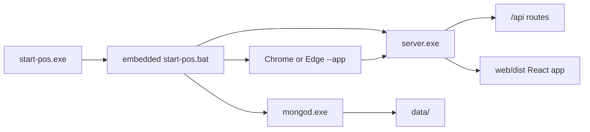

# Water Refilling Station POS Desktop Deployment Guide

## Architecture Overview

The desktop version uses a "Local Browser Kiosk" pattern:

- MongoDB runs as local database (port 27017)
- Node.js Express server runs as API + static file server (port 5000)
- Chrome/Edge runs in app mode (borderless, full-screen)



## System Requirements

- Windows 10/11 (64-bit)
- 4GB RAM minimum (8GB recommended)
- 2GB free disk space
- Google Chrome or Microsoft Edge installed

## Quick Start (End Users)

1. Download `Water-Refilling-POS-Desktop.zip` and extract to any folder
2. Double-click `start-pos.exe`
3. Chrome/Edge opens in full-screen kiosk mode
4. Sign in with your credentials (`admin@h2o.com` / `Admin@123` on first run)

`start-pos.bat` and `start-pos.vbs` remain available for manual troubleshooting, but `start-pos.exe` is the primary launcher.

## Building the Desktop Package

### Prerequisites

- Windows 10/11
- Node.js 18+
- MongoDB Community ZIP binaries (`mongod.exe`)

### Build Steps

Place MongoDB Community ZIP contents in the repo at `mongodb/` (must include `mongodb/bin/mongod.exe`), then run:

```batch
:: From repository root
build-desktop.bat
```

The build script auto-detects `mongodb\bin` when `MONGODB_BIN` is not set.

The desktop build also creates `start-pos.exe` by embedding the batch launcher and applies an icon generated from `web/src/assets/Watermarks POS icon.png`.

Manual alternative:

```bash
cd web && npm run build
cd ../backend && npm run build && npm run package:win
```

Then assemble `Water-Refilling-POS-Desktop/` using the structure below.

## Distribution Folder Structure

```
Water-Refilling-POS-Desktop/
├── start-pos.exe
├── start-pos.bat
├── start-pos.vbs
├── server.exe
├── mongod.exe
├── .env
├── data/
├── uploads/
├── logs/
├── backups/
└── web/
    └── dist/
        ├── index.html
        └── assets/
```

## MongoDB Binary Setup

Download MongoDB 7.0 Community (ZIP) from:
https://www.mongodb.com/try/download/community

Extract the ZIP so this repo contains:

```
mongodb/
└── bin/
    ├── mongod.exe
    └── vc_redist.x64.exe   (optional, for client PCs missing VC++ runtime)
```

The build copies `mongod.exe` into the distribution folder automatically.

Local database path is configured in `start-pos.bat`:

```
mongod.exe --dbpath "data" --bind_ip 127.0.0.1 --port 27017
```

## Environment Configuration

Production desktop settings live in `.env` (copied from `backend/.env.desktop`):

| Variable | Desktop Value |
|----------|---------------|
| NODE_ENV | production |
| PORT | 5000 |
| MONGODB_URI | mongodb://127.0.0.1:27017/water-refilling-pos?retryWrites=false |
| CLIENT_URL | http://localhost:5000 |

Change JWT secrets before deploying to client machines.

## First-Run Admin Account

On startup, `start-pos.bat` runs `server.exe --seed-admin-only` to create a default admin if none exists:

| Field | Value |
|-------|-------|
| Email | `admin@h2o.com` |
| Password | `Admin@123` |

If the admin already exists, seeding is skipped. No other sample data is created.

## Security Considerations

1. **Firewall:** MongoDB (27017) and the app (5000) bind to localhost only
2. **Data:** All data stays on the local machine under `data/`
3. **Authentication:** JWT auth remains enforced
4. **Secrets:** Replace default JWT secrets in `.env`

## Customization

### Changing Port

Edit `.env` and `start-pos.bat`:

- Set `PORT=5000` to your desired port
- Update browser launch URL: `--app="http://localhost:PORT"`

### Changing Database Path

Edit the MongoDB line in `start-pos.bat`:

```
mongod.exe --dbpath "data" --bind_ip 127.0.0.1 --port 27017
```

## Data Backup

| Data | Location |
|------|----------|
| Database | `data/` |
| Uploads | `uploads/` |
| Backups | `backups/` |
| Logs | `logs/` |

To backup: copy the entire `data/` folder.
To reset: delete `data/` (WARNING: all data lost).

## Troubleshooting

| Issue | Solution |
|-------|----------|
| Launcher log needed | Check `logs/launcher.log` for hidden launcher startup errors |
| Port already in use | Kill existing `mongod.exe` / `server.exe` or change port |
| MongoDB won't start | Check `data/` permissions; delete `mongod.lock` if stale |
| Server can't connect to MongoDB | Use `127.0.0.1` in `MONGODB_URI`, not `localhost` (IPv6 mismatch) |
| White screen | Open browser devtools; verify `http://127.0.0.1:5000/api/health` |
| Can't upload files | Ensure `uploads/` exists and is writable |
| Antivirus blocks server.exe | Sign the executable or add an exclusion |

## Stopping the Application

Close the launcher window or run:

```batch
taskkill /F /IM start-pos.exe
taskkill /F /IM mongod.exe
taskkill /F /IM server.exe
```
