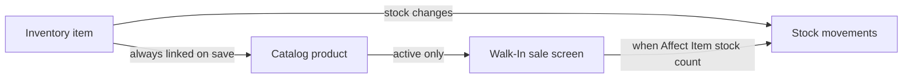

# Inventory & Walk-In Guide

This guide describes how **Inventory**, the **Walk-In** product catalog, and **walk-in sales** fit together after the 2026-07-25 UX update.

## Overview

| Concept | Where it lives | Purpose |
|---------|----------------|---------|
| **Inventory item** | Inventory page | Physical stock: name, SKU, unit, stock count, production, adjustments |
| **Catalog product** | Linked to an inventory item | Sellable item on Walk-In: retail/wholesale/special pricing, active/disabled, stock behavior |
| **Walk-In sale** | Walk-In page (`/pos`) | Ring up customers using active catalog products |



Inventory is the source of truth for **what you stock**. The catalog is the source of truth for **what you sell** and at what price tiers.

---

## Walk-In page

- **Sidebar label:** Walk-In (URL remains `/pos`; permission remains `pos:*`).
- **New Sale tab:** Active catalog products. Walk-in customers use retail pricing; registered customers use their tier (wholesale/special).
- **Sales History tab:** Past POS and walk-in transactions.
- **Product Catalog tab (admin):** Add items to the catalog from inventory, set retail price and active/disabled status. Full pricing and stock settings are edited in Inventory.

---

## Inventory page

### Filters

Two dropdowns replace the old low-stock toggle:

| Filter | Options |
|--------|---------|
| **Stock** | All Stock, Low Stock |
| **Catalog** | All Catalog, Active, Disabled, No Catalog |

The table includes a **Catalog Status** column: Active, Disabled, or No Catalog.

### Add / Edit Item

One modal ([`InventoryItemFormModal`](web/src/components/InventoryItemFormModal.tsx)) always shows inventory and Walk-In catalog fields together.

**Inventory section:**

- Name, SKU, unit, category, **cost / base price**, description
- Initial quantity (create only), low-stock threshold

**Walk-In catalog section:**

- Purchase price (cost), **Retail (Tier A)**, Wholesale (Tier B), Special (Tier C)
- Product category (refill, container, rental, other)
- **Affect Item stock count** — when enabled, sales decrease linked inventory stock
- Catalog status: Active (visible on Walk-In) or Disabled (hidden, history preserved)

Saving always creates or updates both the inventory item and its linked catalog product.

### Stock operations

- **Production** — increase stock with remarks
- **Adjust** — manual +/- adjustment with reason

---

## Walk-In → Product Catalog tab

### Add to catalog

1. Click **Add to Catalog**
2. Select an inventory item that is not already in the catalog
   - Use the **Add** button beside the select (same pattern as invoice customer picker) to open the full combined Add Item form; this creates inventory + catalog in one step
3. For existing uncataloged inventory only: confirm **retail price** and **Active / Disabled**

New catalog entries default to category **refill** with **Affect Item stock count** enabled.

### Edit catalog entry

Minimal edit: **retail price** and **status** only.

For wholesale/special pricing, product category, or stock behavior, edit the item in **Inventory** (with **Add to product catalog** enabled).

### Remove from catalog

Delete removes the catalog product only. The inventory item and past sales history are kept.

---

## Settings

**Walk-In → Catalog** — per-product retail / wholesale / special prices (for walk-in sales).

**Customer Pricing Tiers** (below on Settings) — slim and round gallon rates per tier for deliveries and collection.

---

## API (inventory list)

`GET /api/inventory` supports:

| Query param | Values | Description |
|-------------|--------|-------------|
| `stockFilter` | `low` | Items at or below low-stock threshold |
| `catalogStatus` | `active`, `disabled`, `none` | Filter by linked catalog product status |
| `notInCatalog` | `true` | Items with no linked catalog product |

Each row may include:

```json
"linkedProduct": { "_id": "...", "status": "active" }
```

Omitted or `null` when the item has no catalog entry.

---

## Typical workflows

### New sellable refill product

1. **Inventory → Add Item** — set stock details; enable **Add to product catalog**; set pricing and Active
2. Item appears on **Walk-In → New Sale**

### Stock-only item (not sold on Walk-In)

1. **Inventory → Add Item** — leave **Add to product catalog** off
2. Use Production / Adjust for stock; item shows **No Catalog** in the list

### Add existing inventory to catalog later

1. **Walk-In → Product Catalog → Add to Catalog**
2. Pick the inventory item → confirm price and status

Or edit in **Inventory**, enable **Add to product catalog**, and save.

### Temporarily hide from sale

- **Catalog tab:** Edit → set status to Disabled  
- **Or Inventory:** Edit item → catalog status Disabled

Disabled products stay in transaction history and reappear when set back to Active.
