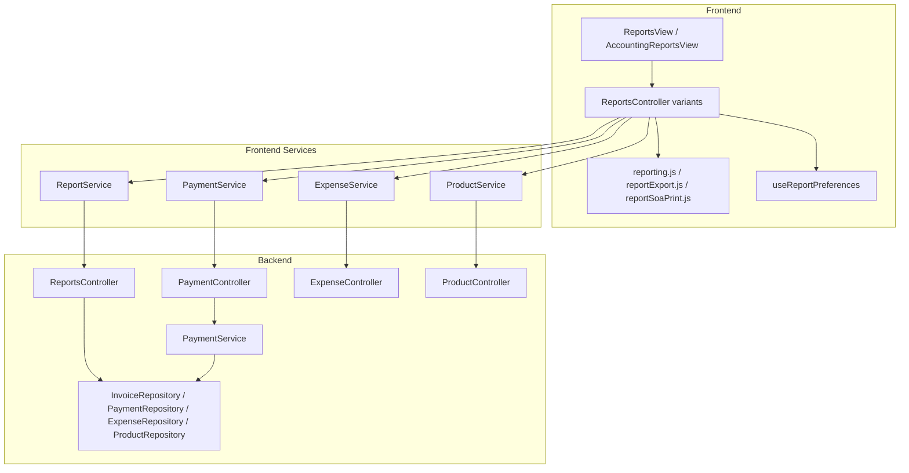
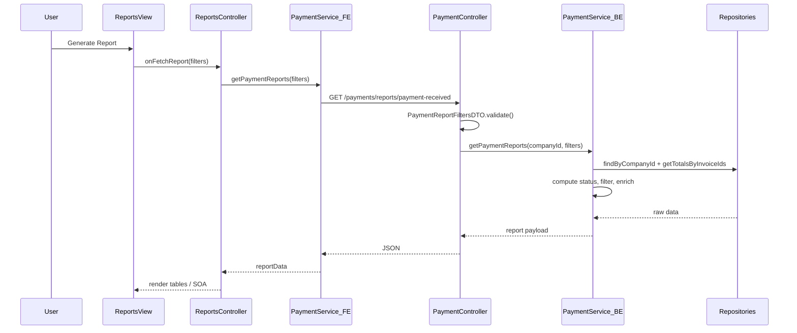

# Financial Reports — Reference & Duplication Guide

This document describes how the **financial reports page** works in chua-system: architecture, filters, report generation, display, export, and role variants. The second half is a replication blueprint for porting the same pattern to another project.

**Scope:** Financial reports only (8 report types). Excludes the operational dashboard (`/reports/operational`, `ManagerReportsView.jsx`).

---

## Part 1 — Reference

### 1. Overview

The financial reports page is a unified UI for generating, previewing, customizing, exporting, and printing financial reports. Users:

1. Select a report type
2. Set filters (date range, customer, branch, payment method, status)
3. Click **Generate Report** to fetch data from the backend
4. View results on screen (tables, summary stats, or Statement of Account)
5. Optionally customize visible columns (persisted in localStorage)
6. Export CSV/PDF or print (Ctrl/Cmd+P)

#### Routes

| Route | Controller | Roles |
|-------|------------|-------|
| `/admin/reports` | `ReportsController` | `super_admin`, `admin`, `manager`, `accounting` |
| `/manager/reports` | `ManagerReportsController` | `manager` |
| `/accounting/reports` | `AccountingReportsController` | `accounting` |

Defined in `frontend/src/App.jsx`.

#### Report types

Eight types, keyed in `frontend/src/presentation/utils/reporting.js` (`REPORT_TITLE_MAP`):

| Key | UI label |
|-----|----------|
| `payment-received` | Payments Received |
| `outstanding` | Outstanding Balances |
| `credit-aging` | Credit / Aging |
| `invoice-summary` | Invoice Summary |
| `commission` | Commission Report |
| `expense-summary` | Expense Summary |
| `profit-loss` | P&L Overview |
| `inventory-valuation` | Inventory Valuation |

---

### 2. High-Level Architecture



**Pattern:** Controller/View split on the frontend. Controllers own fetch, export, and print logic; views own filter UI and table rendering.

**Backend:** There is no single `ReportService`. Logic is split across:

- `PaymentService` — payment/invoice reports (5 types)
- `ReportsController` — profit & loss (direct repo/model access)
- `ExpenseRepository` — expense summary aggregation
- `ProductRepository` — inventory valuation aggregation

---

### 3. Report Types Catalog

| Type | Frontend service method | Backend endpoint | Backend generator | Cached |
|------|------------------------|------------------|-------------------|--------|
| `payment-received` | `PaymentService.getPaymentReports()` | `GET /api/payments/reports/payment-received` | `PaymentService.getPaymentReports` | Yes (120s) |
| `outstanding` | `PaymentService.getOutstandingBalances()` | `GET /api/payments/reports/outstanding` | `PaymentService.getOutstandingBalances` | Yes (120s) |
| `credit-aging` | `PaymentService.getCreditAgingReport()` | `GET /api/payments/reports/credit-aging` | `PaymentService.getCreditAgingReport` | Yes (120s) |
| `invoice-summary` | `PaymentService.getInvoiceSummaryReport()` | `GET /api/payments/reports/invoice-summary` | `PaymentService.getInvoiceSummaryReport` | No |
| `commission` | `PaymentService.getCommissionReport()` | `GET /api/payments/reports/commission` | `PaymentService.getCommissionReport` | No |
| `expense-summary` | `ExpenseService.getExpenseSummary()` | `GET /api/expenses/reports/summary` | `ExpenseRepository.getSummary` | Yes (120s) |
| `profit-loss` | `ReportService.getProfitLoss()` | `GET /api/reports/profit-loss` | `ReportsController.getProfitLoss` | Yes (120s) |
| `inventory-valuation` | `ProductService.getInventoryValuation()` | `GET /api/products/reports/valuation` | `ProductRepository.getInventoryValuation` | Yes (300s) |

Endpoints are defined in:

- `frontend/src/infrastructure/http/endpoints.js`
- `backend/src/presentation/routes/paymentRoutes.js`
- `backend/src/presentation/routes/reportsRoutes.js`

---

### 4. Filter System (End-to-End)

#### 4.1 UI layer

Filter state lives in the view (`ReportsView.jsx`, `AccountingReportsView.jsx`):

```js
{ startDate, endDate, paymentMethod, status[], customerId, branchId, companyId }
```

- Updated via `handleFilterChange` / `handleDateRangeChange`
- Sent to the controller on **Generate Report** via `buildFilterPayload()` — strips null/empty values
- **Filters are not persisted**; only column preferences are saved to localStorage

```142:151:frontend/src/presentation/views/admin/ReportsView.jsx
  const buildFilterPayload = () => ({
    ...filters,
    startDate: filters.startDate || undefined,
    endDate: filters.endDate || undefined,
    paymentMethod: filters.paymentMethod || undefined,
    status: filters.status && filters.status.length > 0 ? filters.status : undefined,
    customerId: filters.customerId || undefined,
    branchId: filters.branchId || undefined,
    companyId: filters.companyId || undefined,
  });
```

#### 4.2 Which filters apply per report type

| Report category | Date range | Payment method | Status | Customer | Branch | Company |
|-----------------|------------|----------------|--------|----------|--------|---------|
| Payment reports (5 types) | Yes | Yes | Yes | Yes | Yes | Super admin only |
| `expense-summary`, `profit-loss` | Yes | No | No | No | No | Super admin only |
| `inventory-valuation` | No | No | No | No | No | Implicit from auth |
| `commission` | Yes | No | No | Yes | Yes | Super admin only |

Accounting view additionally enforces a **93-day max** date range in the UI before calling the controller.

#### 4.3 Backend validation

Payment reports use `PaymentReportFiltersDTO` (`backend/src/application/dtos/PaymentReportFiltersDTO.js`):

| Param | Validation |
|-------|------------|
| `startDate`, `endDate` | Valid ISO dates; start ≤ end; max 93-day range |
| `paymentMethod` | One of: `cash`, `check`, `bank_transfer`, `credit_card`, `gcash`, `others` |
| `status` | Array or comma-separated; values: `paid`, `unpaid`, `partial`, `credit` |
| `customerId`, `branchId` | Pass-through (no format validation) |

Validation throws HTTP 400 with `code: 'report_validation_failed'`.

#### 4.4 Payment status computation

Every payment report derives invoice payment status from totals:

```js
if (totalPayments === 0)        paymentStatus = 'unpaid';
else if (totalPayments > total) paymentStatus = 'credit';   // overpaid
else if (totalPayments >= total) paymentStatus = 'paid';
else                            paymentStatus = 'partial';
```

Batch totals come from `PaymentRepository.getTotalsByInvoiceIds()` to avoid N+1 queries.

#### 4.5 Status intersection (frontend + backend must stay in sync)

Each report type restricts which statuses are eligible. If the user selects status filters, those are intersected with the report defaults. If no status filter is set, the report defaults apply.

**Frontend** (`ALLOWED_STATUSES_BY_REPORT` in each controller):

```108:113:frontend/src/presentation/controllers/admin/ReportsController.jsx
const ALLOWED_STATUSES_BY_REPORT = {
  'payment-received': ['paid', 'partial', 'credit'],
  'outstanding': ['unpaid', 'partial'],
  'credit-aging': ['credit', 'partial'],
  'invoice-summary': ['unpaid', 'partial', 'paid', 'credit'],
};
```

**Backend** (`getAllowedStatusesForReport` in `PaymentService.js`):

```26:35:backend/src/application/services/PaymentService.js
const getAllowedStatusesForReport = (reportType) => {
  const allowed = {
    'payment-received': ['paid', 'partial', 'credit'],
    'outstanding': ['unpaid', 'partial'],
    'credit-aging': ['credit', 'partial'],
    'invoice-summary': ['unpaid', 'partial', 'paid', 'credit'],
  };
  return new Set(allowed[reportType] || []);
};
```

The view disables status checkboxes outside the allowed set for the current report type.

#### 4.6 Company scoping

| Role | Behavior |
|------|----------|
| Super admin | Must select a company via `SelectedCompanyContext`; controller injects `companyId` into filters |
| Admin / manager / accounting | Locked to `user.companyId` |
| Backend | Resolves company from `companyId` query param or `X-Company-Id` header via `PaymentController._resolveCompanyId()` |

Super admin sees a blocking alert until a company is selected.

---

### 5. Report Generation Logic (Per Type)

#### 5.1 Standard fetch flow



Controller dispatch (`ReportsController.jsx` → `fetchReport`):

```237:260:frontend/src/presentation/controllers/admin/ReportsController.jsx
      if (reportType === 'payment-received') {
        data = await paymentService.getPaymentReports(effectiveFilters);
      } else if (reportType === 'outstanding') {
        data = await paymentService.getOutstandingBalances(effectiveFilters);
      } else if (reportType === 'credit-aging') {
        data = await paymentService.getCreditAgingReport(effectiveFilters);
      } else if (reportType === 'invoice-summary') {
        data = await paymentService.getInvoiceSummaryReport(effectiveFilters);
      } else if (reportType === 'commission') {
        data = await paymentService.getCommissionReport(effectiveFilters);
      } else if (reportType === 'expense-summary') {
        data = await expenseService.getExpenseSummary({ ... });
      } else if (reportType === 'profit-loss') {
        data = await reportService.getProfitLoss({ ... });
      } else if (reportType === 'inventory-valuation') {
        data = await productService.getInventoryValuation();
      }
```

Changing report type clears `reportData`, `activeReportFilters`, and SOA context.

#### 5.2 Payment Received

**Algorithm** (`PaymentService.getPaymentReports`):

1. Check cache (`payment:report:{companyId}:payment-received:{filterKey}`)
2. Fetch all company payments (optionally filtered by `paymentMethod`)
3. Fetch all company invoices
4. Filter invoices by date range (invoice date, not payment date)
5. Intersect status filters with allowed statuses; batch-fetch payment totals per invoice
6. Filter payments to matching invoice IDs
7. Apply branch/customer filters via invoice lookup
8. Enrich each payment row with invoice, customer, totals, balance, paymentStatus
9. Return `{ payments[], summary: { totalAmount, totalCount, byMethod }, customerBalances[] }`

#### 5.3 Outstanding Balances

**Algorithm** (`PaymentService.getOutstandingBalances`):

1. Fetch invoices (filtered by customer/branch at repo level)
2. Filter by invoice date range
3. Batch-fetch payment totals per invoice
4. Compute outstanding amount = `invoice.total - totalPayments`
5. Include rows where payment status is in allowed set (default: `unpaid`, `partial`)
6. Return `{ outstanding[], summary: { totalOutstanding, count }, customerBalances[] }`

Each outstanding row: `{ invoice, totalAmount, paidAmount, outstandingAmount, paymentStatus }`.

#### 5.4 Credit / Aging

**Algorithm** (`PaymentService.getCreditAgingReport`):

1. Fetch and date-filter invoices
2. For each invoice, compute payment status and outstanding amount
3. **Include only:**
   - `credit` status (overpaid), OR
   - `partial` status that is overdue (`now > invoice.date`) with outstanding balance > 0
4. Compute `daysPastDue = floor((now - invoice.date) / 86400000)`
5. Bucket into: `0-30`, `31-60`, `61-90`, `90+`
6. Return `{ agingBuckets: { '0-30': [], ... }, summary: { bucket totals }, customerBalances[] }`

#### 5.5 Invoice Summary

**Algorithm** (`PaymentService.getInvoiceSummaryReport`):

1. Fetch invoices (customer/branch filters at repo level)
2. Date-filter by invoice date
3. Batch-fetch payment totals and payment counts per invoice
4. Filter by allowed statuses (default: all four)
5. Return `{ summary[], totals: { totalInvoices, totalInvoiceAmount, totalPaid, totalOutstanding, byStatus }, customerBalances[] }`

Each summary row: `{ invoice, paymentStatus, totalPaid, outstandingBalance, paymentCount }`.

**Not cached.**

#### 5.6 Commission

**Algorithm** (`PaymentService.getCommissionReport`):

1. Fetch invoices via `InvoiceRepository.findByCompanyIdForReport()` (lean, populated)
2. Date-filter by invoice date
3. Flatten `invoice.commissions[]` into rows: `{ invoiceNumber, date, customer, repName, unitPrice, totalAmount }`
4. Return `{ data[], summary: { totalAmount, totalCount } }`

**Not cached.** No status or payment method filters.

#### 5.7 Expense Summary

**Endpoint:** `GET /api/expenses/reports/summary?startDate&endDate`

**Generator:** `ExpenseRepository.getSummary` (MongoDB aggregation by category)

**Returns:** `{ totalAmount, totalCount, byCategory: [{ category, totalAmount, count, percentage }] }`

Date filters optional. Always uses `status: 'active'` expenses.

#### 5.8 Profit & Loss

**Endpoint:** `GET /api/reports/profit-loss?companyId&startDate&endDate`

**Generator:** `ReportsController.getProfitLoss`

```141:159:backend/src/presentation/controllers/ReportsController.js
    const [paymentAgg, expenses] = await Promise.all([
      PaymentModel.aggregate([
        { $match: paymentMatch },
        { $group: { _id: null, total: { $sum: '$amount' } } },
      ]),
      this.expenseRepository.sumActiveByCompanyAndDateRange(companyId, startDate, endDate),
    ]);
    // revenue = paymentAgg total; net = revenue - expenses
```

**Returns:** `{ revenue, expenses, net, startDate, endDate }`

Revenue is summed from **payment dates**; expenses from **expense dates**.

#### 5.9 Inventory Valuation

**Endpoint:** `GET /api/products/reports/valuation`

**Generator:** `ProductRepository.getInventoryValuation`

**Returns:** `{ totalStockValue, activeProducts, totalUnits, items[], bySupplier[], byWarehouse[] }`

No date filters. Snapshot of current stock at cost.

---

### 6. Statement of Account (SOA) Special Mode

SOA is not a separate report type — it is a **display mode** for Outstanding Balances when a customer is selected.

#### Trigger

```12:14:frontend/src/presentation/utils/statementOfAccountHTML.js
export const isStatementOfAccountMode = (reportType, filters = {}) => (
  reportType === 'outstanding' && !!filters.customerId
);
```

#### Behavior differences

| Aspect | Standard outstanding | SOA mode |
|--------|---------------------|----------|
| Title | "Outstanding Balances" | "Statement of Account" |
| Display | Ant Design tables grouped by customer | `StatementOfAccount.jsx` HTML preview |
| Column selector | Visible | Hidden |
| Print | jsPDF autotable | HTML → `window.print()` |
| PDF | jsPDF landscape | html2canvas → jsPDF portrait |

#### Context loading

When outstanding report is fetched with `customerId`, the controller calls `loadSoaPrintContext()` which fetches:

- Company record (name, logo, address)
- Company settings (`chequePayableTo` for cheque instructions)
- Customer record

Admin/manager/accounting can edit cheque payee inline; saved via `CompanySettingsService.updateCompanySettings()`.

#### SOA document structure

Built by `buildOutstandingSoaPrintDocument()` in `statementOfAccountHTML.js`:

1. **Office copy** — company header, customer info, outstanding invoice table, totals, cheque payee
2. **DR appendix** — delivery receipt details per invoice (reuses `invoicePrintHTML.js`)
3. **Client copy** — duplicate of office copy for customer

#### Print path

`printOutstandingSoaReport()` → builds HTML → `openStatementOfAccountPrint()` → new window → `window.print()`

#### PDF path

`downloadOutstandingSoaPdf()` in `reportSoaPrint.js`:

1. Mount HTML off-screen
2. Wait for images to load
3. `html2canvas` capture
4. Slice canvas into letter-size pages if needed
5. `jsPDF` portrait, save as `statement-of-account-{customer}-{date}.pdf`

---

### 7. On-Screen Display

#### Payment reports

- Summary stats row (Statistic components): totals, counts, bucket amounts
- Data grouped by customer via `groupByCustomer()` in the controller
- Each customer section is a Card with a Table inside
- Payment Received also renders hidden invoice-style print pages for duplicate-copy printing

#### Financial reports

Dedicated renderers in `FinancialReportsPanels.jsx`:

- `renderExpenseSummaryReport()` — category breakdown table + totals
- `renderProfitLossReport()` — revenue / expenses / net lines
- `renderInventoryValuationReport()` — product list + supplier/warehouse breakdowns

#### Table columns

`buildReportTableColumns()` in `reporting.js` filters `REPORT_COLUMN_DEFINITIONS` to only visible columns in user-defined order. Column cell renderers are provided by the view (currency formatting, status tags, etc.).

#### Report header block

Print/export headers include:

- Company name
- Report title (SOA-aware via `getReportTitle()`)
- Date range label
- Optional generated date (toggleable)

---

### 8. Column Selection & Preferences

#### Column definitions

Single source of truth in `REPORT_COLUMN_DEFINITIONS` (`reporting.js`):

```js
{ key, label, width }  // width used for PDF column sizing
```

Grouped in the UI as: Primary, Products, Amounts, Status, Payment Details.

Core column presets per report type are defined in `CORE_COLUMN_KEYS`.

#### UI component

`ReportColumnSelector.jsx`:

- Popover with search
- Presets: All / Core / Details / Clear
- Grouped checkboxes
- Drag reorder for visible columns via `@dnd-kit/core` + `@dnd-kit/sortable`

#### Persistence

`useReportPreferences(scope, reportType)` hook:

- Storage key: `chua-system.reports.{admin|manager|accounting}.preferences`
- Per report type: `{ selectedColumns, columnOrder, showGeneratedDate }`
- Scopes are isolated — admin prefs do not affect manager prefs

#### Export alignment

The same column metadata drives all outputs:

1. `createReportColumnMeta()` — maps column keys to value resolvers (customer names, currency, product names)
2. `getOrderedColumns()` — applies visibility + order
3. `applyColumnOrderToDefinitions()` + `calculateColumnWidths()` — for PDF layout

Screen, CSV, and PDF always use the same column set and order.

---

### 9. Export & Print

#### Output paths summary

| Output | Standard payment reports | SOA | Financial reports |
|--------|-------------------------|-----|-------------------|
| CSV | Client-side from fetched data (controller CSV generators) | N/A in SOA mode | `generateFinancialReportCSV()` |
| PDF | jsPDF landscape + jspdf-autotable | html2canvas + jsPDF portrait | `appendFinancialReportPdfBody()` |
| Print | `doc.autoPrint()` → blob URL in new tab | `window.print()` on HTML doc | Same as PDF path |

#### Export entry point

View `handleExportClick(format)` → controller `handleExport(format, filters, options)`:

1. Resolve effective filters (inject super admin companyId)
2. Fetch data if not already loaded (`fetchReportDataByType` for financial; `paymentService.exportReport` for payment reports — returns same JSON as the GET endpoint)
3. Build CSV or PDF using column preferences from options
4. Download blob: `{reportType}-{date}.csv` or `.pdf`

Financial CSV/PDF uses shared helpers in `reportExport.js`:

```12:48:frontend/src/presentation/utils/reportExport.js
export async function fetchReportDataByType(reportType, services, filters = {}) {
  // dispatches to the correct frontend service method per report type
}
```

#### Backend export endpoint (audit only)

`GET /api/payments/reports/export?reportType&format&filters`

Returns JSON report data + audit log entry. **Does not generate a file.**

`backend/src/infrastructure/external/ReportExportService.js` (pdfkit/CSV generators) exists but is **unused** — all file generation is client-side.

#### Print

`handlePrint()` in controller:

- SOA: `printOutstandingSoaReport()` (HTML path)
- Standard: `generateReportPDF()` → `doc.autoPrint()` → open blob URL → close on `afterprint`
- Requires report data to exist first

**Keyboard shortcut:** Ctrl/Cmd+P intercepted globally in each controller.

#### Payment Received special case

PDF export for payment-received can append duplicate invoice-style pages per unique invoice ID (hidden DOM elements rendered by the view).

---

### 10. Role-Based Variants

Three nearly identical controllers (~800 lines duplicated each):

| Aspect | Admin | Manager | Accounting |
|--------|-------|---------|------------|
| View | `ReportsView` | `ReportsView` (shared) | `AccountingReportsView` |
| Preferences scope | `admin` | `manager` | `accounting` |
| Report types | All 8 | All 8 | 7 (no `inventory-valuation`) |
| Company scope | Super admin company picker | User's company | User's company |
| Date range limit | None in UI | None in UI | 93 days enforced in view |
| Filter UI | Full payment filters | Same as admin | Hides payment method/status for commission & finance reports |
| CSS classes | `report-*` | `report-*` | `accounting-report-*` |
| Companies list | Fetched, passed to view | `companies={[]}` | Fetched for header |

Core fetch/export/print logic is duplicated across all three controllers. When replicating, consolidate into one parameterized controller.

---

### 11. Caching & Invalidation

In-memory cache via `CacheService` (`backend/src/infrastructure/cache/`).

| Cache key pattern | TTL | Used by |
|-------------------|-----|---------|
| `payment:report:{companyId}:{type}:{filterKey}` | 120s | payment-received, outstanding, credit-aging |
| `report:pl:{companyId}:{start}:{end}` | 120s | profit-loss |
| `expense:sum:{companyId}:{start}:{end}:active` | 120s | expense summary |
| `product:val:{companyId}` | 300s | inventory valuation |

`buildFilterKey(filters)` — sorted JSON of non-empty filter values for stable cache keys.

**Not cached:** invoice-summary, commission.

**Invalidation:** `invalidateFinancialCache(companyId)` clears all financial caches when payments or expenses are created/updated. Called from `PaymentService.createPayment()` and expense write paths.

---

### 12. Key File Map

#### Frontend

```
frontend/src/
├── App.jsx                                          # Routes
├── application/services/
│   ├── PaymentService.js                            # Payment report API calls
│   ├── ReportService.js                             # P&L only
│   ├── ExpenseService.js                            # Expense summary
│   └── ProductService.js                            # Inventory valuation
├── presentation/
│   ├── controllers/
│   │   ├── admin/ReportsController.jsx              # Admin reports controller
│   │   ├── manager/ManagerReportsController.jsx     # Manager (same logic)
│   │   └── accounting/AccountingReportsController.jsx
│   ├── views/
│   │   ├── admin/ReportsView.jsx                    # Shared by admin + manager
│   │   └── accounting/AccountingReportsView.jsx     # Accounting variant
│   ├── components/
│   │   ├── ReportColumnSelector.jsx                 # Column picker UI
│   │   └── reports/
│   │       ├── FinancialReportsPanels.jsx           # Expense/P&L/inventory renderers
│   │       └── StatementOfAccount.jsx               # SOA HTML preview
│   ├── hooks/
│   │   └── useReportPreferences.js                  # localStorage column prefs
│   └── utils/
│       ├── reporting.js                             # Column defs, titles, prefs, table builder
│       ├── reportExport.js                          # Financial CSV/PDF + fetchReportDataByType
│       ├── reportSoaPrint.js                        # SOA print/PDF (html2canvas)
│       └── statementOfAccountHTML.js                # SOA HTML document builder
└── infrastructure/http/
    ├── apiClient.js
    └── endpoints.js                                 # Report endpoint paths
```

#### Backend

```
backend/src/
├── application/
│   ├── dtos/PaymentReportFiltersDTO.js              # Filter validation
│   └── services/PaymentService.js                   # Payment report generation
├── presentation/
│   ├── controllers/
│   │   ├── PaymentController.js                     # Payment report endpoints + export
│   │   ├── ReportsController.js                     # P&L
│   │   ├── ExpenseController.js                     # Expense summary
│   │   └── ProductController.js                     # Inventory valuation
│   └── routes/
│       ├── paymentRoutes.js                         # /payments/reports/*
│       └── reportsRoutes.js                         # /reports/profit-loss
├── infrastructure/
│   ├── repositories/
│   │   ├── InvoiceRepository.js
│   │   ├── PaymentRepository.js
│   │   ├── ExpenseRepository.js
│   │   └── ProductRepository.js
│   ├── cache/
│   │   ├── cacheKeys.js
│   │   └── cacheInvalidate.js
│   └── external/ReportExportService.js              # UNUSED — dead code
```

---

## Part 2 — Replication Guide

Use this section when porting the financial reports pattern to another project.

### A. Minimum Viable Copy

Start with these pieces; skip role duplication initially.

**Backend:**

1. `PaymentReportFiltersDTO` — filter validation
2. Five payment report endpoints under `/api/payments/reports/*`
3. P&L endpoint (`/api/reports/profit-loss`)
4. Expense summary endpoint (`/api/expenses/reports/summary`)
5. Optional: inventory valuation endpoint
6. `getAllowedStatusesForReport()` + payment status computation
7. `PaymentRepository.getTotalsByInvoiceIds()` batch helper

**Frontend:**

1. Single controller + single view (not three)
2. `reporting.js` — report type enum, column definitions, prefs
3. `reportExport.js` — financial CSV/PDF helpers
4. `ReportColumnSelector.jsx` — column customization
5. Client-side export only (jsPDF + CSV blob download)

**Skip initially:**

- SOA mode (add after standard reports work)
- Three role-specific controllers/views
- Backend `ReportExportService` (unused in this project)
- Backend export endpoint (audit-only; client generates files)

### B. Implementation Order

1. **Define report types + column definitions** — `REPORT_TITLE_MAP`, `REPORT_COLUMN_DEFINITIONS`, `CORE_COLUMN_KEYS`
2. **Backend endpoints** — filters DTO, status rules, payment status computation, batch totals
3. **Frontend filter UI + fetch + table display** — controller dispatch, view filters, Ant Design tables
4. **Column preferences** — `useReportPreferences` + localStorage
5. **CSV/PDF export** — jsPDF autotable path first; financial report helpers
6. **SOA mode** — HTML builder, print, html2canvas PDF (last; most complex)
7. **Role variants + company scoping** — only if needed

### C. Patterns Worth Keeping

| Pattern | Why |
|---------|-----|
| Column definitions as single source of truth | Screen, CSV, and PDF stay in sync |
| `buildFilterPayload()` strips nulls | Clean API query params |
| Report-type-specific allowed statuses (UI + backend) | Prevents invalid filter combinations |
| SOA as display mode, not separate API | Reuses outstanding endpoint; only UI/export changes |
| Batch invoice totals (`getTotalsByInvoiceIds`) | Avoids N+1 on every report |
| `fetchReportDataByType()` dispatcher | Single export entry point for all types |
| Filter key for cache (`buildFilterKey`) | Stable cache keys regardless of param order |

### D. Patterns Worth Improving When Copying

| Current state | Recommendation |
|---------------|----------------|
| ~800 lines duplicated across 3 controllers | One `ReportsController` with `scope` prop |
| `ReportsView` + `AccountingReportsView` near-duplicates | Single view with props for CSS prefix, date limit, report type list |
| `ReportExportService.js` unused on backend | Remove or wire it up — don't copy dead code |
| PDF/CSV generators inline in controller | Extract to `reportPdfExport.js` / `reportCsvExport.js` |
| Commission CSV missing in manager controller | Fix by sharing export logic |

### E. Dependencies

**Frontend (npm):**

```
jspdf
jspdf-autotable
html2canvas          # SOA PDF only
@dnd-kit/core        # column reorder
@dnd-kit/sortable
antd
dayjs
```

**Backend:** No extra packages — uses existing Express + MongoDB stack.

### F. Test Checklist

Use this when validating a port:

- [ ] Each report type generates with empty filters
- [ ] Date range validation rejects ranges > 93 days (backend DTO)
- [ ] Accounting UI warns on date range > 93 days
- [ ] Status filter intersection works per report type (e.g. outstanding excludes `paid`)
- [ ] Credit aging only shows credit + overdue partial invoices
- [ ] SOA mode activates when outstanding + customer selected
- [ ] SOA title changes to "Statement of Account"
- [ ] Column preferences persist across page reload (per scope + report type)
- [ ] CSV column order matches on-screen table
- [ ] PDF column order matches on-screen table
- [ ] Super admin blocked until company selected
- [ ] Manager/accounting scoped to own company only
- [ ] Export works without prior Generate (fetches on demand)
- [ ] Ctrl/Cmd+P prints current report
- [ ] Cache invalidates after payment create/update
- [ ] P&L revenue uses payment dates; expenses use expense dates

### G. File Checklist for New Project

Copy or recreate these files in order:

**Phase 1 — Backend core**

- [ ] `PaymentReportFiltersDTO.js`
- [ ] `PaymentService.js` (report methods: getPaymentReports, getOutstandingBalances, getCreditAgingReport, getInvoiceSummaryReport, getCommissionReport)
- [ ] `PaymentController.js` (report handlers)
- [ ] `paymentRoutes.js` (report routes)
- [ ] `ReportsController.js` (getProfitLoss)
- [ ] `reportsRoutes.js`
- [ ] `cacheKeys.js` + `cacheInvalidate.js`

**Phase 2 — Frontend core**

- [ ] `endpoints.js` (report paths)
- [ ] `PaymentService.js`, `ReportService.js`, `ExpenseService.js`, `ProductService.js` (frontend)
- [ ] `reporting.js`
- [ ] `useReportPreferences.js`
- [ ] `ReportColumnSelector.jsx`
- [ ] `ReportsController.jsx` (single controller)
- [ ] `ReportsView.jsx`

**Phase 3 — Export**

- [ ] `reportExport.js`
- [ ] CSV/PDF generators in controller (or extracted utils)

**Phase 4 — SOA (optional)**

- [ ] `statementOfAccountHTML.js`
- [ ] `reportSoaPrint.js`
- [ ] `StatementOfAccount.jsx`

**Phase 5 — Financial panels**

- [ ] `FinancialReportsPanels.jsx`

---

## Appendix — Response Shapes

Quick reference for API response structures:

```js
// payment-received
{ payments: [], summary: { totalAmount, totalCount, byMethod }, customerBalances: [] }

// outstanding
{ outstanding: [{ invoice, totalAmount, paidAmount, outstandingAmount, paymentStatus }], summary: { totalOutstanding, count }, customerBalances: [] }

// credit-aging
{ agingBuckets: { '0-30': [], '31-60': [], '61-90': [], '90+': [] }, summary: {}, customerBalances: [] }

// invoice-summary
{ summary: [{ invoice, paymentStatus, totalPaid, outstandingBalance, paymentCount }], totals: {}, customerBalances: [] }

// commission
{ data: [{ invoiceNumber, date, customer, repName, unitPrice, totalAmount }], summary: { totalAmount, totalCount } }

// expense-summary
{ totalAmount, totalCount, byCategory: [{ category, totalAmount, count, percentage }] }

// profit-loss
{ revenue, expenses, net, startDate, endDate }

// inventory-valuation
{ totalStockValue, activeProducts, totalUnits, items: [], bySupplier: [], byWarehouse: [] }
```
